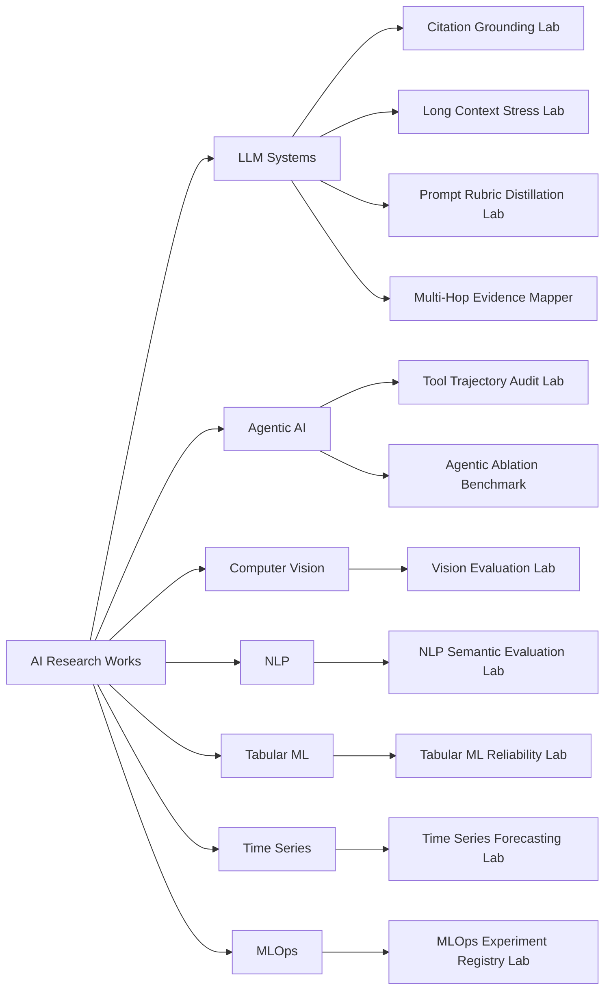

# AI Research Works

[](https://github.com/akifitu/ai-research-works/actions/workflows/ci.yml)
[](LICENSE)
[](https://www.python.org/)

This repository is a portfolio-ready AI research engineering monorepo. It
covers LLM evaluation, agentic AI reliability, computer vision, NLP, tabular
machine learning, time-series data science, and MLOps experiment governance.
Each lab is intentionally dependency-light so the repository remains easy to
review, test, and extend before heavy model infrastructure is introduced.

## Portfolio Signal

- Research-oriented tooling instead of one-off demos
- Provider-agnostic project structure that can grow lab by lab
- Reproducible benchmark manifests, reports, and architecture docs
- Python stdlib-first baseline with CI-backed unit tests
- Practical coverage across LLMs, agents, CV, NLP, ML, data science, and MLOps

## Repository Map



## Projects

| Project | Discipline | Research Signal | Deep Dive |
| --- | --- | --- | --- |
| `citation-grounding-lab` | LLM / RAG | Claim extraction, evidence retrieval, support scoring, contradiction heuristics | [Architecture](projects/citation-grounding-lab/docs/ARCHITECTURE.md) |
| `tool-trajectory-audit-lab` | Agentic AI | Loop detection, failure recovery analysis, redundant action scoring | [Architecture](projects/tool-trajectory-audit-lab/docs/ARCHITECTURE.md) |
| `agentic-ablation-benchmark` | Agentic AI | Variant comparison, completion scoring, recovery deltas, cost and latency tradeoffs | [Architecture](projects/agentic-ablation-benchmark/docs/ARCHITECTURE.md) |
| `long-context-stress-lab` | LLM / Context Engineering | Relevant coverage, noise ratios, unsupported insertion scoring | [Architecture](projects/long-context-stress-lab/docs/ARCHITECTURE.md) |
| `prompt-rubric-distillation-lab` | LLM Evaluation | Dimension inference, ambiguity flags, normalized weights, scorecards | [Architecture](projects/prompt-rubric-distillation-lab/docs/ARCHITECTURE.md) |
| `multi-hop-evidence-mapper` | LLM / Multi-Hop Reasoning | Hop support scoring, bridge checks, conclusion grounding | [Architecture](projects/multi-hop-evidence-mapper/docs/ARCHITECTURE.md) |
| `vision-evaluation-lab` | Computer Vision | Bounding-box IoU, detection matching, classification metrics | [Architecture](projects/vision-evaluation-lab/docs/ARCHITECTURE.md) |
| `nlp-semantic-evaluation-lab` | NLP | Token overlap, LCS similarity, entity F1, intent accuracy | [Architecture](projects/nlp-semantic-evaluation-lab/docs/ARCHITECTURE.md) |
| `tabular-ml-reliability-lab` | Machine Learning | Data profiling, drift signals, missingness shifts, leakage flags | [Architecture](projects/tabular-ml-reliability-lab/docs/ARCHITECTURE.md) |
| `time-series-forecasting-lab` | Data Science | Rolling backtests, moving-average baselines, MAE, SMAPE | [Architecture](projects/time-series-forecasting-lab/docs/ARCHITECTURE.md) |
| `mlops-experiment-registry-lab` | MLOps | Experiment ranking, promotion gates, reproducibility metadata checks | [Architecture](projects/mlops-experiment-registry-lab/docs/ARCHITECTURE.md) |

## Repository Standards

- MIT licensed repository and project artifacts
- Every lab has its own README, benchmark, config, source package, tests, and technical docs
- No local model download is required for the baseline test suite
- CI runs every lab independently through a GitHub Actions matrix
- Benchmark assets are small, auditable, and designed for future expansion

## Quick Start

Run one lab locally:

```powershell
pip install ./projects/vision-evaluation-lab
vision-evaluation-lab --benchmark projects/vision-evaluation-lab/benchmarks/sample_vision_benchmark.json
```

Run a lab test suite from source:

```powershell
$env:PYTHONPATH="projects/vision-evaluation-lab/src"
python -m unittest discover -s projects/vision-evaluation-lab/tests -p "test_*.py"
```

## Layout

```text
.
|-- .github/workflows/ci.yml
|-- docs/
|   |-- AI_DISCIPLINE_MAP.md
|   `-- PORTFOLIO_ROADMAP.md
|-- projects/
|   |-- agentic-ablation-benchmark/
|   |-- citation-grounding-lab/
|   |-- long-context-stress-lab/
|   |-- mlops-experiment-registry-lab/
|   |-- multi-hop-evidence-mapper/
|   |-- nlp-semantic-evaluation-lab/
|   |-- prompt-rubric-distillation-lab/
|   |-- tabular-ml-reliability-lab/
|   |-- time-series-forecasting-lab/
|   |-- tool-trajectory-audit-lab/
|   `-- vision-evaluation-lab/
|-- LICENSE
`-- README.md
```

## Why This Repo Works As Portfolio Material

- It reads like a long-lived research engineering workspace, not a scratchpad
- It covers both model-facing work and production-facing evaluation concerns
- It demonstrates how to design testable AI infrastructure without hiding behind heavyweight dependencies
- It is ready for future labs in reinforcement learning, recommender systems, multimodal AI, graph ML, and speech AI
