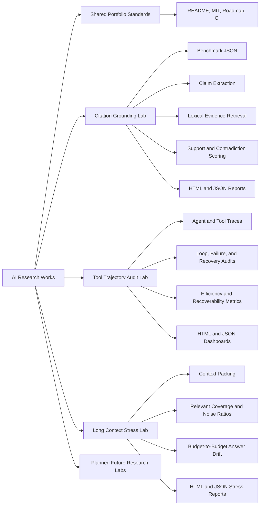

# AI Research Works

[](https://github.com/akifitu/ai-research-works/actions/workflows/ci.yml)
[](LICENSE)
[](https://www.python.org/)

This repository is a portfolio-ready AI research engineering monorepo focused
on evaluation tooling, experiment design, and reproducible LLM systems work.
It is structured to look credible on GitHub before any local model is installed
or benchmark is executed.

## Portfolio Signal

- Research-oriented tooling instead of one-off demos
- Provider-agnostic experiment structure that can grow project by project
- Reproducible benchmark manifests, reports, and architecture docs
- No local model dependency in the repository baseline
- Static-review-friendly code and CI setup for future expansion

## Repository Map



## Projects

| Project | Focus | Research Signal | Deep Dive |
| --- | --- | --- | --- |
| `citation-grounding-lab` | Citation-aware RAG and LLM answer evaluation | Claim extraction, evidence retrieval, support scoring, contradiction heuristics, HTML reporting | [Architecture](projects/citation-grounding-lab/docs/ARCHITECTURE.md) |
| `tool-trajectory-audit-lab` | Agent and tool trace auditing | Loop detection, failure recovery analysis, redundant action scoring, HTML reporting | [Architecture](projects/tool-trajectory-audit-lab/docs/ARCHITECTURE.md) |
| `long-context-stress-lab` | Long-context packing and answer drift analysis | Relevant coverage, noise ratios, unsupported insertion scoring, HTML reporting | [Architecture](projects/long-context-stress-lab/docs/ARCHITECTURE.md) |

## Repository Standards

- MIT licensed repository and project artifacts
- Python stdlib-first implementation to avoid forced local setup
- Docs-first project structure with architecture and implementation plans
- GitHub Actions CI prepared for future portfolio growth
- Every project lives under `projects/` with its own README and technical docs

## Near-Term Roadmap

The repository now contains multiple polished projects and is designed to keep
expanding into a broader AI research portfolio. The next planned labs are tracked in
[docs/PORTFOLIO_ROADMAP.md](docs/PORTFOLIO_ROADMAP.md).

## Featured Projects

`citation-grounding-lab` is a research-engineering framework for checking
whether generated answers are actually supported by the documents they cite.
The project includes:

- Sentence-level claim extraction from answers
- Inline citation parsing such as `[doc_id]`
- Chunked lexical retrieval across the provided evidence set
- Heuristic support and contradiction scoring for each claim
- Aggregate faithfulness metrics and HTML report generation

`tool-trajectory-audit-lab` is a companion research project for auditing
agent/tool execution traces. It focuses on whether an LLM-driven workflow
recovers cleanly from errors, avoids redundant loops, and keeps tool usage
efficient enough to be trustworthy in production settings.

`long-context-stress-lab` studies what happens as context budgets grow. It
audits how relevant evidence is packed, how much irrelevant noise enters the
window, and whether recorded answers drift away from the reference as prompts
become longer.

## Layout

```text
.
├── .github/workflows/ci.yml
├── docs/
│   └── PORTFOLIO_ROADMAP.md
├── projects/
│   ├── citation-grounding-lab/
│   │   ├── benchmarks/
│   │   ├── configs/
│   │   ├── docs/
│   │   ├── src/
│   │   └── tests/
│   ├── long-context-stress-lab/
│   │   ├── benchmarks/
│   │   ├── configs/
│   │   ├── docs/
│   │   ├── src/
│   │   └── tests/
│   └── tool-trajectory-audit-lab/
│       ├── benchmarks/
│       ├── configs/
│       ├── docs/
│       ├── src/
│       └── tests/
├── LICENSE
└── README.md
```

## Why This Repo Works As Portfolio Material

- The repo is organized like a long-lived research engineering workspace
- The projects target real AI engineering problems: grounded generation, agent reliability, and long-context robustness
- The code avoids dependency bloat and local-model requirements
- The documentation reads like a deliberate technical portfolio, not a scratchpad
