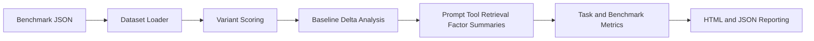

# Architecture

## Overview

`agentic-ablation-benchmark` consumes prerecorded task runs from multiple agent
variants, scores each run, measures deltas versus baseline, and summarizes
which factor changes help or hurt the benchmark.

## Data Flow

## Components

### `dataset.py`

- Loads benchmark and config JSON files
- Serializes experiment outputs

### `scoring.py`

- Computes composite scores from run metrics
- Derives completion, recovery, efficiency, latency, and token-efficiency subscores

### `runner.py`

- Evaluates task variants against the declared baseline
- Emits findings for regressions, winners, loop risk, recovery gaps, and cost spikes

### `metrics.py`

- Summarizes benchmark outcomes and factor deltas

### `reporting.py`

- Produces HTML reports with task tables and factor summaries

## Design Decisions

- Prerecorded runs keep the project lightweight and auditable
- Composite scoring is explicit, not hidden inside a model
- Factor summaries help the benchmark read like a real ablation study
- The schema is future-friendly for repeated-run or significance analysis

## Expected Future Extensions

- Repeated trials and confidence intervals
- Trace import adapters from agent runtimes
- Judge-model quality inputs
- Cross-benchmark dashboards for policy selection

