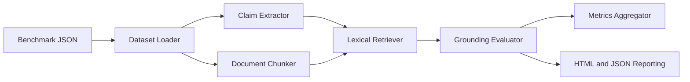

# Architecture

## Overview

`citation-grounding-lab` analyzes answer faithfulness by taking a benchmark of
question-answer pairs plus their supporting documents, extracting claims from
the answer, retrieving likely evidence chunks, and assigning grounding labels.

## Data Flow

## Components

### `dataset.py`

- Loads benchmark and config JSON files
- Serializes experiment outputs for reporting

### `claims.py` and `citations.py`

- Split answer text into sentence-level claims
- Parse inline citations such as `[doc_rag]`
- Remove citation markers before support analysis

### `retrieval.py`

- Chunks source documents with overlap
- Builds a lexical retrieval index from content tokens
- Returns top-k evidence candidates for each claim

### `grounding.py`

- Scores overlap between claims and candidate evidence
- Checks citation alignment
- Detects simple contradiction patterns through numeric and negation mismatch

### `metrics.py`

- Summarizes claim outcomes into sample and benchmark scores
- Produces support rate, contradiction rate, mean support score, and faithfulness

### `reporting.py`

- Converts experiment results into HTML dashboards
- Keeps the project portfolio-friendly with readable artifacts

## Design Decisions

- Stdlib-first implementation keeps setup lightweight
- Heuristic retrieval and scoring provide transparent baselines
- JSON inputs are easy to version control and inspect
- Dataclass-heavy structure makes future extensions predictable

## Expected Future Extensions

- Embedding-based retrievers
- LLM judge integration
- Multi-hop evidence graphs
- Benchmark comparison reports across experiment variants
