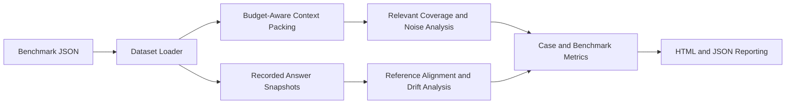

# Architecture

## Overview

`long-context-stress-lab` consumes a benchmark of context items, reference
answers, and recorded answer snapshots at different token budgets. It simulates
packing decisions, evaluates how much relevant evidence survives, and measures
whether answer quality drifts as the context becomes larger and noisier.

## Data Flow

## Components

### `dataset.py`

- Loads the benchmark and config JSON files
- Serializes experiment outputs

### `packing.py`

- Packs context items under explicit token budgets
- Measures relevant coverage and noise ratio

### `drift.py`

- Tokenizes text into lightweight content-token sets
- Scores reference alignment, answer support, and unsupported insertions
- Measures answer consistency between budget tiers

### `runner.py`

- Coordinates packing and drift analysis for each case
- Emits findings such as overflow, dilution, unsupported insertion, and drift

### `metrics.py`

- Summarizes snapshot-level signals into case and benchmark metrics

### `reporting.py`

- Produces HTML reports with budget-tier tables and metric cards

## Design Decisions

- Greedy packing keeps the baseline easy to inspect
- Token estimates are explicit inputs rather than inferred runtime measurements
- Lexical heuristics provide a transparent first layer of analysis
- Budget-tier snapshots allow the project to work without live model execution

## Expected Future Extensions

- Position-aware packing and attention-decay simulations
- Learned or retrieval-informed packing strategies
- Snapshot generation from hosted APIs
- Cross-benchmark comparisons for long-context robustness strategies
