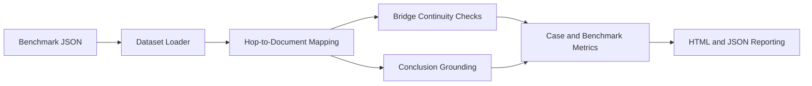

# Architecture

## Overview

`multi-hop-evidence-mapper` consumes multi-document reasoning cases, evaluates
support for each intermediate hop, checks bridge continuity across the chain,
and scores whether the final conclusion is grounded in the mapped evidence.

## Data Flow

## Components

### `dataset.py`

- Loads cases, documents, hops, and config JSON files
- Serializes experiment outputs

### `mapping.py`

- Tokenizes hop claims and documents
- Scores hop support and document contribution
- Measures bridge-term continuity and conclusion support

### `runner.py`

- Coordinates hop mapping and finding generation for each case
- Emits structured chain results and benchmark aggregates

### `metrics.py`

- Summarizes hop support, bridge health, and conclusion grounding

### `reporting.py`

- Produces HTML reports with hop tables and findings lists

## Design Decisions

- Explicit hop claims keep the benchmark inspectable
- Bridge terms make chain continuity auditable without opaque models
- Lexical support is transparent and sufficient for a first portfolio baseline
- Reports preserve enough structure for future graph visualizations

## Expected Future Extensions

- Automatic bridge-term extraction
- Graph export formats for visualization tools
- Hosted-model support for hop repair or alternative chain proposals
- Cross-benchmark analysis for multi-hop retrieval strategies
