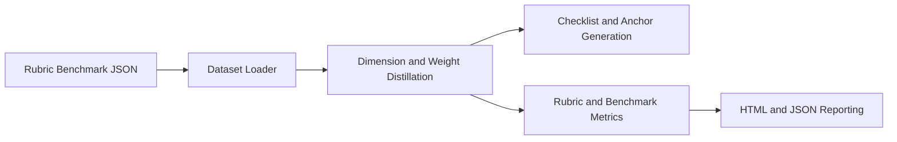

# Architecture

## Overview

`prompt-rubric-distillation-lab` consumes a benchmark of qualitative evaluation
rubrics, distills each criterion into a structured representation, and emits
normalized scorecards with metrics and findings about ambiguity and weight use.

## Data Flow

## Components

### `dataset.py`

- Loads rubric benchmarks and config JSON files
- Serializes experiment outputs

### `distillation.py`

- Infers dimensions from criterion wording
- Detects ambiguous phrases and explicit requirement language
- Normalizes weights and generates checklist prompts

### `runner.py`

- Coordinates distillation for each rubric
- Emits findings such as ambiguity, weight gaps, and general criteria

### `metrics.py`

- Computes rubric-level and benchmark-level ambiguity and specificity metrics

### `reporting.py`

- Produces HTML scorecard reports for portfolio presentation

## Design Decisions

- Heuristics are intentional here because evaluators need to understand the rules
- Weight normalization is explicit so future human calibration is easier
- Output scorecards are version-control-friendly artifacts
- The project remains stdlib-only to keep local setup lightweight

## Expected Future Extensions

- Judge-prompt generation from scorecards
- Agreement analysis across multiple rubric variants
- Spreadsheet and Markdown importers
- Hosted-model assistance for criterion paraphrasing and anchor refinement
