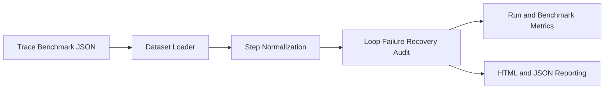

# Architecture

## Overview

`tool-trajectory-audit-lab` consumes a benchmark of agent/tool traces, applies
heuristic audits to each run, generates run-level findings, and then aggregates
those findings into benchmark-wide metrics and HTML reports.

## Data Flow

## Components

### `dataset.py`

- Loads trace benchmark and audit config JSON files
- Serializes experiment outputs

### `normalization.py`

- Canonicalizes tool commands and query text
- Detects empty outputs and error-shaped results

### `auditing.py`

- Detects redundant loops and repeated empty outputs
- Identifies failures and tracks whether they are recovered
- Emits findings with severity and step references

### `metrics.py`

- Computes run-level success, redundancy, and recoverability metrics
- Aggregates benchmark-wide quality signals

### `reporting.py`

- Produces HTML reports with cards and findings tables
- Keeps the project portfolio-friendly and easy to screenshot

## Design Decisions

- Heuristics are preferable here to opaque scoring because the audit should be
  explainable to a reviewer
- JSON trace schema keeps the project portable across agent frameworks
- Stdlib-only packaging avoids forcing a heavy local environment
- Run-level findings are preserved so metrics never hide the underlying evidence

## Expected Future Extensions

- Real trace adapters for LangGraph, OpenAI tool traces, or custom agent logs
- Branch-aware auditing for parallel tool execution
- Cost modeling and token-efficiency analysis
- Cross-run comparisons for prompt or policy ablations
